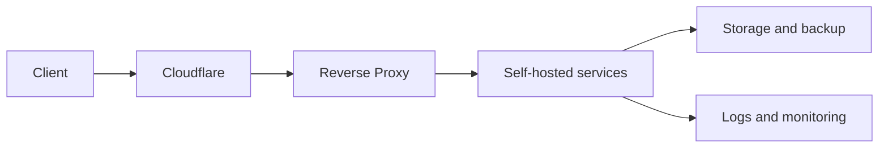

# Architecture

## Intent

This page explains how NicoLab is organized: components, boundaries, dependencies and criteria for deciding what should be published.

## Logical zones

| Zone | Purpose | Examples |
| --- | --- | --- |
| Edge | Public entry point, DNS, TLS, first protection layer | Cloudflare |
| Gateway | Routing toward internal services | Reverse proxy |
| Services | Public or private applications | Immich, Jellyfin, Navidrome |
| Storage | Persistent data and backups | Synology, snapshots |
| Ops | Monitoring and maintenance | uptime, logs, alerts |

## Decision record

Every important change should include:

- date;
- reason;
- affected services;
- risk before/after;
- possible rollback.

## Base diagram

