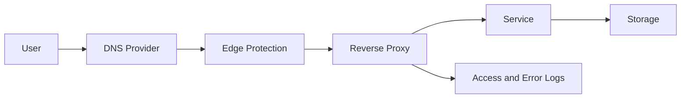

# Flow: Public Service Exposure

This flow describes a public-safe pattern for exposing a self-hosted service.

## Controls

| Step | Control |
| --- | --- |
| DNS | Documented record and owner |
| Edge | TLS, WAF or provider-level protection where useful |
| Proxy | Hostname routing, limited exposed ports |
| Service | Authentication, updates and least privilege |
| Storage | Backups, snapshots and restore tests |
| Logs | Access logs, error logs and alerting |

## Review Questions

- Why does this service need to be public?
- What data does it process?
- How is authentication handled?
- How can exposure be disabled quickly?
- When was the last restore tested?
