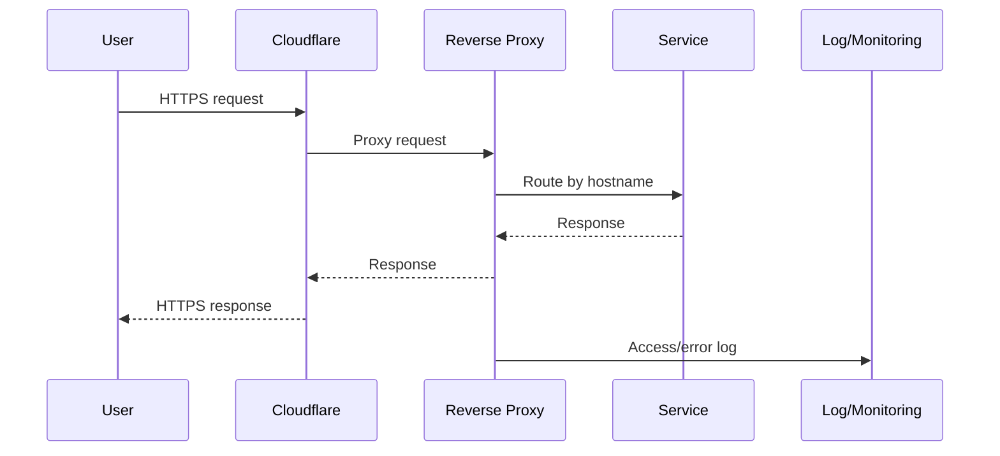

# Networking

## Service publishing flow

## Domain checklist

- Domain or subdomain defined.
- DNS record documented.
- TLS active.
- Service behind a proxy, not directly exposed whenever possible.
- Access rules documented.
- Logs can be checked.

## Questions before exposing anything

- Does this service really need to be public?
- What data does it handle?
- Does it have strong authentication?
- Does a backup exist?
- Is there a quick way to disable public exposure?
